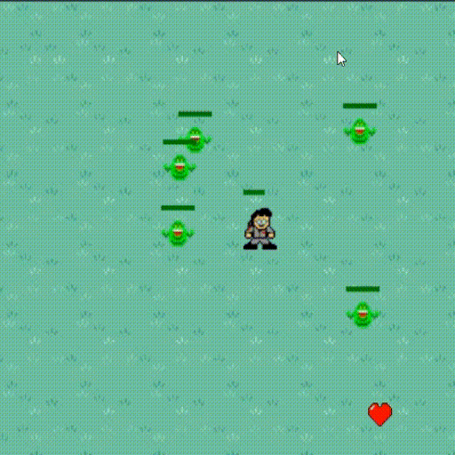
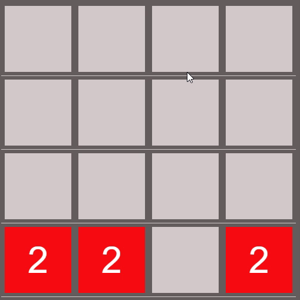
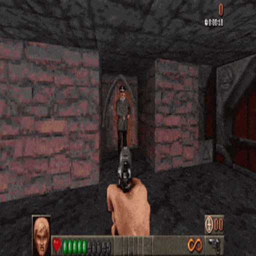

# Projet de Fin d'Année - Programmation WEB Avancée 2024 🚀

Bienvenue dans notre projet de fin d'année en programmation web avancée 2024. Ce projet a été réalisé par Valentin MALCHAIR, Ethan VERSTRINGE, Lukas RICHARD, Simon LECOCK et Gauthier DISCART.

## Jeux développés :

1. **BusterGhost** - Un jeu passionnant développé par Valentin MALCHAIR.
   - Repository : [BusterGhost](/SuperGameLauncher/Games/BusterGhost/)

      

2. **IndiannaDungeon** - Un autre jeu palpitant créé par Ethan VERSTRINGE.
   - Repository : [IndiannaDungeon](/SuperGameLauncher/Games/IndiannaDungeon/)

   

3. **2048** - Une version web du célèbre jeu de puzzle, développée par Lukas RICHARD.
   - Repository : [2048](/SuperGameLauncher/Games/2048/)

   

4. **Froggy Jump** - Un jeu amusant mettant en vedette les talents de Simon LECOCK.
   - Repository : [FroggyJump](/SuperGameLauncher/Image/Bagger288.jpg)

   

5. **Aim Trainer** - Développé par Gauthier DISCART, un jeu pour améliorer votre précision de tir.
   - Repository : [AimTrainer](/SuperGameLauncher/Games/AimTrainer/)

   
